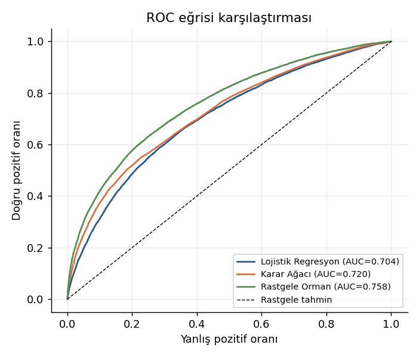
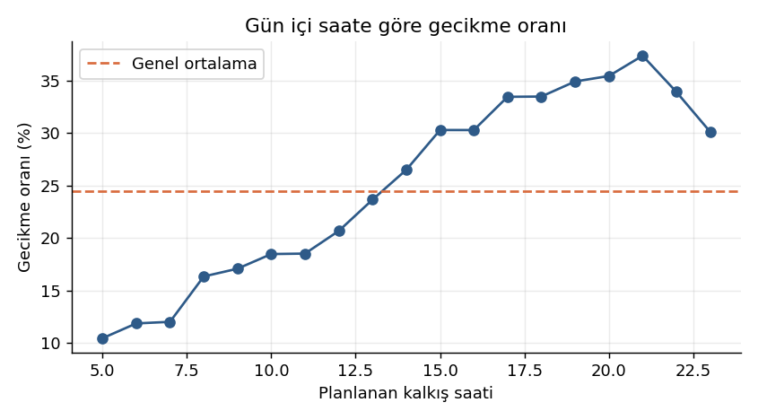

# Uçuş Gecikmesi Tahmini — Makine Öğrenmesi Projesi

2013 yılında New York'un üç havaalanından (JFK, LGA, EWR) yapılan **336.776 uçuşun** verisiyle,
bir uçuşun *kalkıştan önce* bilinebilen bilgilere dayanarak varışta **15 dakika veya daha fazla
gecikip gecikmeyeceğini** tahmin eden bir sınıflandırma projesi.

> Huawei Student Developers — Veri Bilimi ve Makine Öğrenmesi Programı, final projesi.
> Projenin ayrıntılı anlatımı: **[Medium yazısı](https://medium.com/@huseyin.karaa007/u%C3%A7a%C4%9F%C4%B1n%C4%B1z-daha-kalkmadan-gecikece%C4%9Fini-bilebilir-miyiz-98c3366d8623)**

---

## Problem

Havacılıkta bir uçuş, planlanan varış saatinden 15 dakika ve üzeri saptığında "gecikmeli" sayılır.
Bu eşik hedef değişken olarak kullanıldı:

```
is_delayed = 1  →  arr_delay ≥ 15 dk
is_delayed = 0  →  zamanında
```

İptal edilen uçuşlar (`arr_delay` boş olan 9.430 kayıt) farklı bir problem olduğu için veri
setinden çıkarıldı. Kalan **327.346 uçuşun %24,5'i** gecikmeli — yani veri seti dengesiz.

## Veri sızıntısına karşı alınan karar

`dep_delay`, `dep_time`, `air_time` ve `arr_time` sütunları **bilinçli olarak kullanılmadı.**

Bu değişkenler ancak uçak kalktıktan sonra öğrenilebilir. Modele verildiklerinde doğruluk %90'ın
üzerine çıkıyor, ama model pratikte işe yaramaz hâle geliyor: amacı kalkıştan önce karar desteği
sağlamak olan bir sistem, kalkış sonrası bilgiyi giriş olarak kullanamaz.

Kullanılan öznitelikler:

| Tür | Değişkenler |
|---|---|
| Sayısal | `distance`, `sched_dep_hour`, `sched_dep_min`, `month`, `day_of_week`, `is_weekend`, `temp`, `humid`, `wind_speed`, `precip`, `visib`, `pressure` |
| Kategorik | `carrier`, `origin`, `dest` |

Hava durumu değişkenleri, saatlik hava durumu tablosundan **kalkış havaalanı + planlanan saat**
anahtarıyla birleştirildi (eşleşmeyen kayıt oranı: %0,5).

## Veri seti

| Tablo | İçerik | Boyut |
|---|---|---|
| `flights` | 2013 NYC uçuşları | 336.776 × 19 |
| `weather` | Saatlik hava durumu ölçümleri | 26.115 × 15 |

Kaynak: [nycflights13 / data4python4ds](https://github.com/byuidatascience/data4python4ds).
Veri notebook içinde doğrudan URL'den okunuyor — ayrıca indirmeye gerek yok.

## Yöntem

- **Ön işleme:** `ColumnTransformer` + `Pipeline` (medyan/mod ile doldurma, standartlaştırma,
  One-Hot Encoding). Tüm dönüşümler yalnızca eğitim verisiyle öğrenilir.
- **Ayrım:** %80 eğitim (261.876) / %20 test (65.470), `stratify=y`
- **Dengesizlik:** üç modelde de `class_weight="balanced"`
- **Modeller:** Lojistik Regresyon, Karar Ağacı, Rastgele Orman
- **Referans:** "hiçbir uçuş gecikmeyecek" diyen baseline tahminci

## Sonuçlar

| Model | Accuracy | Precision | Recall | F1 | ROC-AUC |
|---|---|---|---|---|---|
| Baseline (hepsi zamanında) | 0,755 | 0,000 | 0,000 | 0,000 | 0,500 |
| Lojistik Regresyon | 0,654 | 0,379 | 0,646 | 0,478 | 0,704 |
| Karar Ağacı | 0,715 | 0,435 | 0,554 | 0,488 | 0,720 |
| **Rastgele Orman** | 0,719 | 0,448 | 0,634 | **0,525** | **0,758** |

Baseline'ın doğruluğu tüm modellerden yüksek, ama recall'u sıfır: gecikmeli 16.020 uçuşun hiçbirini
yakalamıyor. Dengesiz veri setlerinde accuracy tek başına yanıltıcıdır; karşılaştırma **F1 ve
ROC-AUC** üzerinden yapıldı.

En iyi model (Rastgele Orman) test setinde:

- 10.149 gecikme doğru yakalandı
- 5.871 gecikme kaçırıldı
- 12.508 yanlış alarm



## Öne çıkan bulgular

**1. En güçlü sinyal planlanan kalkış saati** (toplam önemin %25,4'ü). Sabah 05:00 uçuşlarında
gecikme oranı %10, akşam 21:00'de %37 — gecikmeler gün boyunca zincirleme birikiyor.



**2. Hava durumu ikinci büyük blok** (basınç, nem, sıcaklık, yağış, görüş, rüzgâr toplamda ~%37).
Yağışın etkisi eşik biçiminde: yağışsız saatlerde gecikme oranı %23 iken, en hafif yağışta bile
%46'ya sıçrıyor.

**3. Doğrusal korelasyonlar zayıf ama ilişki var.** Hiçbir sayısal değişkenin hedefle korelasyonu
0,20'yi geçmiyor; ilişkiler doğrusal olmadığı için ağaç tabanlı modeller doğrusal modeli geçiyor.

**4. Havayolu farkı ölçülebilir:** en kötü ve en iyi taşıyıcı arasında yaklaşık iki kat fark var
(%34,6'ya karşı %18,6).

## Sınırlar ve sonraki adımlar

Modelin en büyük eksiği, uçağın **o günkü geçmişi**. `tailnum` üzerinden "aynı uçağın önceki
seferindeki gecikmesi" değişkeni türetilebilirse ciddi bir kazanç beklenir. Hava trafik kontrol
kısıtları ve varış havaalanının anlık yoğunluğu da modelde yok.

Denenebilecek diğer adımlar: XGBoost / LightGBM, karar eşiğinin maliyet dengesine göre optimize
edilmesi, zaman bazlı ayrım (2013'ün ilk 10 ayıyla eğitip son 2 ayı test etmek).

## Depo yapısı

```
.
├── ucus_gecikme_tahmini.ipynb   # tüm analiz, çıktılarıyla birlikte
├── figures/                     # üretilen grafikler ve tablolar
├── requirements.txt
└── README.md
```

## Çalıştırma

```bash
git clone https://github.com/huseyinkara07/ucus-gecikme-tahmini.git
cd ucus-gecikme-tahmini
pip install -r requirements.txt
jupyter notebook ucus_gecikme_tahmini.ipynb
```

Notebook'un tamamı yaklaşık 4-5 dakikada çalışır (Rastgele Orman eğitimi en uzun adım).

## Kullanılan kütüphaneler

pandas · numpy · scikit-learn · matplotlib
